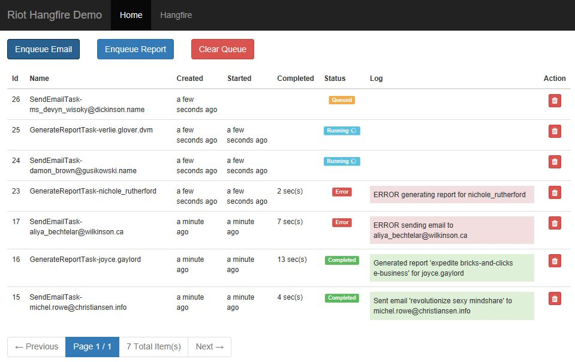

# RiotHangfireDemo
https://github.com/pwhe23/RiotHangfireDemo

Demo Asp.net application using Riot.js and Hangfire.io created for a talk at Modern Devs Charlotte.



Presentation: 
[](https://gitpitch.com/pwhe23/RiotHangfireDemo/master?grs=github&t=white)

## RiotHangfireDemo.Web

RiotHangfireDemo.Web is an standard Asp.net MVC website which bootstraps and hosts our application. The views are created using Riot.js, so there is only a single Home/Index controller action. SignalR is used for notifying the user-interface of job status changes from Hangfire. The service interface implementations also reside here to keep as much external code out of our Domain project as possible.

### Startup.cs

The Configuration method of the Startup.cs class is kicked off by the OwinStartup pipeline and is responsible for bootstrapping the application. Most of the configuration stuff is pretty standard, but there are a few interesting bits. 

The IoC container needs to be able to support both injection into asp.net request-centric things like controllers, but also background jobs being run on a different thread via Hangfire. Luckily SimpleInjector has a Hybrid Lifestyle scope that can help us with that.

```
Container.Options.DefaultScopedLifestyle = Lifestyle.CreateHybrid(() => HttpContext.Current == null,
    new ThreadScopedLifestyle(),
    new WebRequestLifestyle()
);
```

I like being able to automatically Register any of the project service interfaces that has only a single implementation, so I wrote GetInterfacesWithSingleImplementation() to help with that.

```
var services = AppAssemblies.GetInterfacesWithSingleImplementation();
foreach (var service in services)
{
    Container.Register(service.Key, service.Value, Lifestyle.Scoped);
}
```

An often-overlooked useful feature .Net provides is the InternalsVisibleTo assembly attribute. This allows us to expose internal classes to other specific assemblies. It can be very useful for testing purposes, but we also use it here to inject the Domain internal class DemoDb into the container.

```
// RiotHangfireDemo.Domain.AssemblyInfo.cs
[assembly: InternalsVisibleTo("RiotHangfireDemo.Web")]

// RiotHangfireDemo.Web.Startup.cs
Container.Register<IDb, DemoDb>(Lifestyle.Scoped);
```

One of of the great things about strongly-typed languages is that the Type of an object is an additional piece of metadata which can be pretty useful. I love using a class for configuration data and then injecting that class into the IoC container. It can then be injected into any service that needs it. I wrote a simple helper method MapAppSettingsToClass<T>() that can easily take AppSettings keys in the Web.config and map them to the config classes. 

```
// DemoConfig.cs
public class DemoConfig
{
    public int HangfireWorkerCount { get; set; }
    public int RandomizerErrorMax { get; set; }
    public int RandomizerTimeoutMax { get; set; }
};

// Web.config
<appSettings>
    <add key="DemoConfig.HangfireWorkerCount" value="2" />
    <add key="DemoConfig.RandomizerErrorMax" value="8" />
    <add key="DemoConfig.RandomizerTimeoutMax" value="15" />
</appSettings>

// Startup.cs
private static void ConfigureSettings()
{
    var config = Ext.MapAppSettingsToClass<DemoConfig>();
    Container.RegisterSingleton(config);
}

// Randomizer.cs
public Randomizer(DemoConfig config)
{
    _config = config;
}

public TimeSpan GetRandomTimeout()
{
    return TimeSpan.FromSeconds(_random.Next(1, _config.RandomizerTimeoutMax));
}
```

Apparently the .Net Core developers liked this idea too since they added it with the new Configuration IOptions classes. If you aren't really fond of the IOptions, and just want the POCO classes injected with .Net Core, [Filip W has a great article about how to do that](https://www.strathweb.com/2016/09/strongly-typed-configuration-in-asp-net-core-without-ioptionst/).

### HomeController.cs

Since we're using Riot.js to render our views we're not really using much MVC code. The HomeController class is basically empty with only a single Index action that simply renders the View.

### JsonRpcController.cs

The backend API for our application is built entirely using MediatR commands which are dispatched via the ICommander service. While it is not a true JsonRpc implementation, the JsonRpcController is similar in spirit and is the sole endpoint for all of our commands. The primary Post method accepts the command name via a route parameter using the form /jsonrpc/{commandName}. The body of the Post request contains the json which will be bound to an instance of the command for execution, and the result returned to the client.

```
[HttpPost, Route("jsonrpc/{commandName}")]
public ActionResult Post(string commandName)
{
    var commandJson = Request.InputStream.ReadToEnd();

    var result = _commander.Execute(commandName, commandJson);

    return new ContentResult
    {
        Content = JsonConvert.SerializeObject(result),
        ContentType = "application/json",
    };
}
```

Example request from Fiddler:

```
POST http://localhost:60223/jsonrpc/DeleteQueueItem
Content-Type: application/json
Accept: application/json

{"Id":23}
```

Primarily for testing we also have a Get endpoint that accepts the command Name and any QueryString parameters will be bound to the command object.

```
/jsonrpc/DeleteQueueItem?Id=23
```

### PushHub.cs

The PushHub class does not contain any methods, but is used for SignalR routing.

### Commander.cs

The Commander service allows execution of ICommands by MediatR using name and json. The Initialize() method is called from the Startup class passing the assemblies which will be scanned for ICommand classes. It then creates a static dictionary from command name to Type that is used to instantiate the appropriate command from the JsonRpc request. Once the command object is instantiated it is converted from object-typed to IRequest via Reflection so the handler can be invoked by Mediator.

```
var commandType = _commands[commandName];
var command = JsonConvert.DeserializeObject(commandJson, commandType);

var requestInterface = command
    .GetType()
    .GetInterface("IRequest`1");

var executeMethod = mediator
    .GetType()
    .GetMethod(nameof(Send))
    .MakeGenericMethod(requestInterface.GetGenericArguments());

var result = executeMethod.Invoke(mediator, new[] { command });
```

### Pusher.cs

The Pusher service pushes notifications to the clients via SignalR.

```
GlobalHost
    .ConnectionManager
    .GetHubContext<PushHub>()
    .Clients
    .All
    .Push(type, data);
```

### Queue.cs

The Queue service's Enqueue() method accepts ITasks which will be serialized into
QueueItems to be executed in the background by Hangfire. Note that the command Type name
is stored along with the serialized json so it can be executed in the same way that the JsonRpc requests are. Once the QueueItem is saved to the database, we can Enqueue the BackgroundJob using Hangfire.

```
BackgroundJob.Enqueue(() => Execute(queuedTask.Id));
```

You may notice that the queuedTask.Id is the only parameter to the Execute method. It is a Hangfire best practice that the enqueued expressions be as [simple as possible](http://docs.hangfire.io/en/latest/best-practices.html#make-job-arguments-small-and-simple). Since the Queue class has constructor parameters, we need to register the SimpleInjectorJobActivator with Hangfire during startup so the parameters can be injected. This is where the SimpleInjector Hybrid scope will use the ThreadScopedLifestyle instead of the WebRequestLifestyle.

Note that even outside of a valid HttpContext, the Pusher service called by HangfireJobPusher can still communicate with SignalR so our client is notified of changes. 

### HangfireJobPusher.cs

Hangfire uses JobFilterAttributes similar to how MVC does to allow logging of changes to Jobs. The HangfireJobPusher looks for these events and then notifies the client via SignalR.

```
public void OnPerforming(PerformingContext filterContext)
{
    _pusher.NotifyQueueItemsChanged();
}

public void OnStateApplied(ApplyStateContext context, IWriteOnlyTransaction transaction)
{
    _pusher.NotifyQueueItemsChanged();
}
```

### SimpleInjectorJobActivator.cs

I couldn't get the [HangFire.SimpleInjector Nuget package](https://github.com/devmondo/HangFire.SimpleInjector/blob/eec5646c321225e76ea1eb06f01a69e60a273a7f/src/HangFire.SimpleInjector/SimpleInjectorJobActivator.cs) to work with the new ThreadScopedLifestyle I'm using so I copied the source here and fixed it.

```
else if (_lifestyle == Lifestyle.Scoped)
{
    return new SimpleInjectorScope(_container, ThreadScopedLifestyle.BeginScope(_container));
}
```

### Index.cshtml

The sole MVC Index view loads all of the Riot.js tags and then mounts them on the page.

```
@foreach (var tag in _tags)
{
    <script type="riot/tag" src="@tag"></script>
}

<ListQueueItems></ListQueueItems>

<script src="/Content/riot_compiler.min.js"></script>
<script>
    riot.compile(function() {
        riot.mount("*");
    });
</script>
```

### ListQueueItems.tag

The ListQueueItems tag is the root of our Riot.js tag tree. It makes the QueryQueueItems JsonRpc call back to the server to get a paged list of QueueItems. We manually call the load() method when the tag is first mounted.

```
function load() {
    jsonRpc("QueryQueueItems", vm.queryQueueItems, function (result) {
        vm.result = result;
        vm.update();
    });
}

load();
```

We also need to listen for notifications from SignalR about changes to the QueueItem statuses. We wait for the tag mount event so we know the page is ready and we can call jQuery $.connection methods.

```
vm.on("mount", function () {
    var pushHub = $.connection.pushHub;
    pushHub.client.push = function (type, data) {
        vm.trigger(type, data);
    };
    $.connection.hub.start();
});
```

We trigger the Push event sent from the server using the tag riot.observeable on("event", function(){}) method. In the current case we only have a single event we are looking for, and all it does is call load() for us to refresh the QueueItem list.

```
vm.on("QueueItems.Changed", function () {
    load();
});
```

There are also a number of CommandButton child tag calls. Note how the text of the button and the appropriate command to call are provided as attributes to the custom tag.

```
<CommandButton command="EnqueueEmail" text="Enqueue Email" />
```

We can also provide a prompt that will give the user a chance to cancel the click and will also change the color of the button.

```
<CommandButton command="ClearQueue" text="Clear Queue" confirm="Are you sure?" />
```

Using Riot we can iterate through the results using the an each loop.

```
<tr each={ item in result.Items }>
    <td class="text-center">{ item.Id }</td>
    ...
```

We can also provide additional data to the CommandButton like the Id of an individual QueueItem from the loop along with custom css classes and child content which can be yielded from within the tag.

```
<CommandButton command="DeleteQueueItem" confirm="Are you sure?" cls="btn btn-xs btn-danger" data={ {Id:item.Id} }>
    <i class="fa fa-trash"></i>
</CommandButton>
```

We also instantiate the Pager tag to provide generic paging functionality over the PagedList result.

```
<Pager page-number={ result.PageNumber } page-size={ result.PageSize } total-items={ result.TotalItems } />
```

### CommandButton.tag

Riot provides an if={} attribute that can control whether to render the node on the page. The yield tag provides HTML transclusion so the parent can pass content to be rendered by the child. It does not appear currently that multiple transclusion slots are available yet like in Aurelia.

```
<button if={ !!command && !confirm } type="button" class="{ cls }" onclick={ clicked }>
  { text } <yield />
</button>
```

The tag will receive all the data passed with attributes via the opts object. I generally map the this context to a vm variable because this tends to sometimes change on you in javascript. It appears to be a best practice to map the opts (which are all strings except 'data') back to the vm so you can change their types and provide defaults if need be.

```
var vm = this;

vm.command = vm.opts.command;
vm.text = vm.opts.text;
vm.confirm = vm.opts.confirm;
vm.data = vm.opts.data;
vm.cls = vm.opts.cls || (!vm.opts.confirm ? "btn btn-primary" : "btn btn-danger");
```

Tags can capture events on elements like clicks that can be passed on to methods.

```
<button ... onclick={ clicked }>

vm.clicked = function () {
    if (!!vm.confirm && !confirm(vm.confirm)) {
        return;
    }

    jsonRpc(vm.command, vm.data);
};
```

### Pager.tag

The Pager tag provides generic paging functionality over the PagedList result returned from commands. Riot child tags can trigger events on the parent tag as a way to notify them of events.

```
vm.previousClicked = function () {
    vm.parent.trigger("Pager.Clicked", vm.pageNumber - 1);
};

vm.nextClicked = function () {
    vm.parent.trigger("Pager.Clicked", vm.pageNumber + 1);
};
```

Riot tags can also provide custom styles which are injected into the head of the page, once no many how many instances are mounted.

```
<Pager>
    ...
    <style>
        div.alert { margin:1em 0; }
        span.button { cursor:pointer; }
    </style>
</Pager>
```    

### Resources

* [ASP.NET MVC](https://www.asp.net/mvc) gives you a powerful, patterns-based way to build dynamic websites that enables a clean separation of concerns and that gives you full control over markup for enjoyable, agile development.
* [Riot.js](http://riotjs.com/) is a simple and elegant component-based UI library that brings custom tags to all browsers. A custom tag glues relevant HTML and JavaScript together forming a reusable component. Think React + Polymer but with enjoyable syntax and a small learning curve.
* [Hangfire](https://www.hangfire.io/) is an easy way to perform background processing in .NET and .NET Core applications. No Windows Service or separate process required. It is backed by persistent storage and open and free for commercial use.
* [Bootstrap](http://getbootstrap.com/) is the most popular HTML, CSS, and JS framework for developing responsive, mobile first projects on the web.
* [Font Awesome](http://fontawesome.io/) gives you scalable vector icons that can instantly be customized - size, color, drop shadow, and anything that can be done with the power of CSS.
* [Moment.js](https://momentjs.com/) Parse, validate, manipulate, and display dates and times in JavaScript.
* [JsonRPC](http://www.jsonrpc.org/specification) JSON-RPC is a stateless, light-weight remote procedure call (RPC) protocol
* [SignalR](https://www.asp.net/signalr) makes developing real-time web functionality for Asp.net truly easy. SignalR allows bi-directional communication between server and client.
* [Simple Injector](https://simpleinjector.org/) is an easy-to-use Dependency Injection (DI) library for .NET 4+ that supports Silverlight, Windows Phone, Windows 8 including Universal apps and Mono. Simple Injector is highly optimized for performance and concurrent use.
* [Json.NET](http://www.newtonsoft.com/json) is a popular high-performance JSON framework for .NET that can serialize and deserialize any .NET object.

## RiotHangfireDemo.Domain

RiotHangfireDemo.Domain contains the majority of our business logic via the Commands. It also contains the internal EF Model classes and the internal DemoDb database context class. Finally, the Service interfaces are defined here which must be implemented by our application host, the Mvc website.

### QueryQueueItems.cs

QueryQueueItems is an example of a query command that returns a PagedList of QueueItemInfo DTOs. My commands always provide their own response types so that our internal domain objects are never exposed and we have a consistent api surface area. To help with mapping, I use BatMap to ProjectTo our DTOs from the Entity Framework domain models.

```
public class QueryQueueItems : IRequest<PagedList<QueryQueueItems.QueueItemInfo>>, ICommand, IPageable
{
    public string Status { get; set; }
    public int? PageNumber { get; set; }
    public int? PageSize { get; set; }

    public class QueueItemInfo
    {
        public int Id { get; set; }
        public string Name { get; set; }
        public string Status { get; set; }
        public DateTime Created { get; set; }
        public DateTime? Started { get; set; }
        public DateTime? Completed { get; set; }
        public string Type { get; set; }
        public string Data { get; set; }
        public string Log { get; set; }
    };

    internal class Handler : IRequestHandler<QueryQueueItems, PagedList<QueueItemInfo>>
    {
        private readonly IDb _db;

        public Handler(IDb db)
        {
            _db = db;
        }

        public PagedList<QueueItemInfo> Handle(QueryQueueItems cmd)
        {
            var queueItems = _db
                .Query<QueueItem>()
                .AsQueryable();

            if (cmd.Status != null)
            {
                queueItems = queueItems
                    .Where(x => x.Status == cmd.Status);
            }

            return queueItems
                .ProjectTo<QueueItemInfo>(checkIncludes: true)
                .OrderByDescending(x => x.Id)
                .ToPagedList(cmd);
        }
    };
};
```

### ICommand interface

ICommand is a placeholder interface to find Commands which can be executed by Commander. These may be invoked via a JsonRpcController api request, or triggerd by Hangfire job in the background. Commander maintains a mapping of ICommand name to Types.

```
public interface ICommand
{
};
```

### ITask interface

The ITask interface is used for any commands that can be serialized into QueueItems to be executed in the background by Hangfire.

```
public interface ITask : IRequest<TaskResult>, ICommand
{
    string Name { get; }
};
```

### PagedList

The PagedList class can be used as the response of any IPageable ICommand and allows the Riot Pager.tag to page through the results.

```
public class PagedList<T>
{
    public T[] Items { get; set; }
    public int PageNumber { get; set; }
    public int PageSize { get; set; }
    public int TotalItems { get; set; }
};
```

### Resources

* [MediatR](https://github.com/jbogard/MediatR) is a simple, unambitious mediator implementation in .NET. Supports request/response, commands, queries, notifications and events, synchronous and async with intelligent dispatching via C# generic variance.
* [Faker.cs](https://github.com/oriches/faker-cs) is used to easily generate fake data: names, addresses, phone numbers, etc.
* [Entity Framework](https://docs.microsoft.com/en-us/ef/) is an object-relational mapper (O/RM) that enables .NET developers to work with a database using .NET objects. It eliminates the need for most of the data-access code that developers usually need to write.)
* [BatMap](https://dogusteknoloji.github.io/BatMap/) is an opininated (yet another) mapper, mainly to convert between EF Entities and DTOs.

## RiotHangfireDemo.Tests

RiotHangfireDemo.Tests contains a simple example of how commands can be unit tested since this is a common question. 

```
[Fact]
public void Test_QueryQueueItems_Status()
{
    var db = A.Fake<IDb>();
    A.CallTo(() => db.Query<QueueItem>()).Returns(_queryItems);

    var cmd = new QueryQueueItems
    {
        Status = QueueItem.COMPLETED,
    };
    var result = new QueryQueueItems.Handler(db).Handle(cmd);

    result.Items.Length.ShouldBe(1);
    result.Items[0].Id.ShouldBe(4);
}
```

I find it a best testing practice to provide interfaces for any services touching the outside world, the IDb, IClock, and IRandomizer service interfaces are examples of this.

```
public class Clock : IClock
{
    public DateTime Now() => DateTime.Now;
};
```

### Resources

* [xUnit.net](https://xunit.github.io/) is a free, open source, community-focused unit testing tool for the .NET Framework.
* [FakeItEasy](https://fakeiteasy.github.io/) is a .Net dynamic fake framework for creating all types of fake objects, mocks, stubs etc.
* [Shouldly](https://github.com/shouldly/shouldly) is an assertion framework which focuses on giving great error messages when the assertion fails while being simple and terse.

## What's missing

Most importantly token authentication, since in a production app we wouldn't want just anyone executing anything they want :). The commands could be secured with an AuthorizeAttribute containing Users or Roles, much like the one used for asp.net controllers and actions, or something more complex like configuring user privilege for each command. The Commander service would probably be a good place to do the enforcement since it gathers the ICommand metadata and could also access the app context to get the current user, etc.
